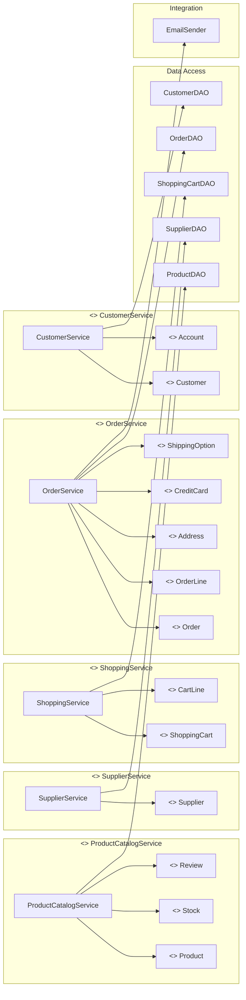

```mermaid
flowchart LR
  %%=== Service Components ===%%
  subgraph ProductCatalogComponent ["<<service>> ProductCatalogService"]
    direction TB
    PCService["ProductCatalogService"]
    Product["<<entity>> Product"]
    Stock["<<value object>> Stock"]
    Review["<<value object>> Review"]
  end

  subgraph SupplierComponent ["<<service>> SupplierService"]
    direction TB
    SupplierServiceComponent["SupplierService"]
    Supplier["<<value object>> Supplier"]
  end

  subgraph ShoppingComponent ["<<service>> ShoppingService"]
    direction TB
    ShoppingServiceComponent["ShoppingService"]
    ShoppingCart["<<entity>> ShoppingCart"]
    CartLine["<<value object>> CartLine"]
  end

  subgraph OrderComponent ["<<service>> OrderService"]
    direction TB
    OrderServiceComponent["OrderService"]
    Order["<<entity>> Order"]
    OrderLine["<<value object>> OrderLine"]
    Address["<<value object>> Address"]
    CreditCard["<<value object>> CreditCard"]
    ShippingOption["<<value object>> ShippingOption"]
  end

  subgraph CustomerComponent ["<<service>> CustomerService"]
    direction TB
    CustomerServiceComponent["CustomerService"]
    Customer["<<entity>> Customer"]
    Account["<<value object>> Account"]
  end

  %%=== Data Access ===%%
  subgraph DataAccess ["Data Access"]
    direction TB
    ProductDAO["ProductDAO"]
    SupplierDAO["SupplierDAO"]
    ShoppingCartDAO["ShoppingCartDAO"]
    OrderDAO["OrderDAO"]
    CustomerDAO["CustomerDAO"]
  end

  %%=== Integration ===%%
  subgraph Integration ["Integration"]
    direction TB
    EmailSender["EmailSender"]
  end

  %%=== Intra‐Component Orchestration ===%%
  PCService --> Product
  PCService --> Stock
  PCService --> Review

  SupplierServiceComponent --> Supplier

  ShoppingServiceComponent --> ShoppingCart
  ShoppingServiceComponent --> CartLine

  OrderServiceComponent --> Order
  OrderServiceComponent --> OrderLine
  OrderServiceComponent --> Address
  OrderServiceComponent --> CreditCard
  OrderServiceComponent --> ShippingOption

  CustomerServiceComponent --> Customer
  CustomerServiceComponent --> Account

  %%=== Service → DAO Dependencies ===%%
  PCService --> ProductDAO
  SupplierServiceComponent --> SupplierDAO
  ShoppingServiceComponent --> ShoppingCartDAO
  OrderServiceComponent --> OrderDAO
  CustomerServiceComponent --> CustomerDAO

  %%=== Service → Integration Dependency ===%%
  OrderServiceComponent --> EmailSender
```